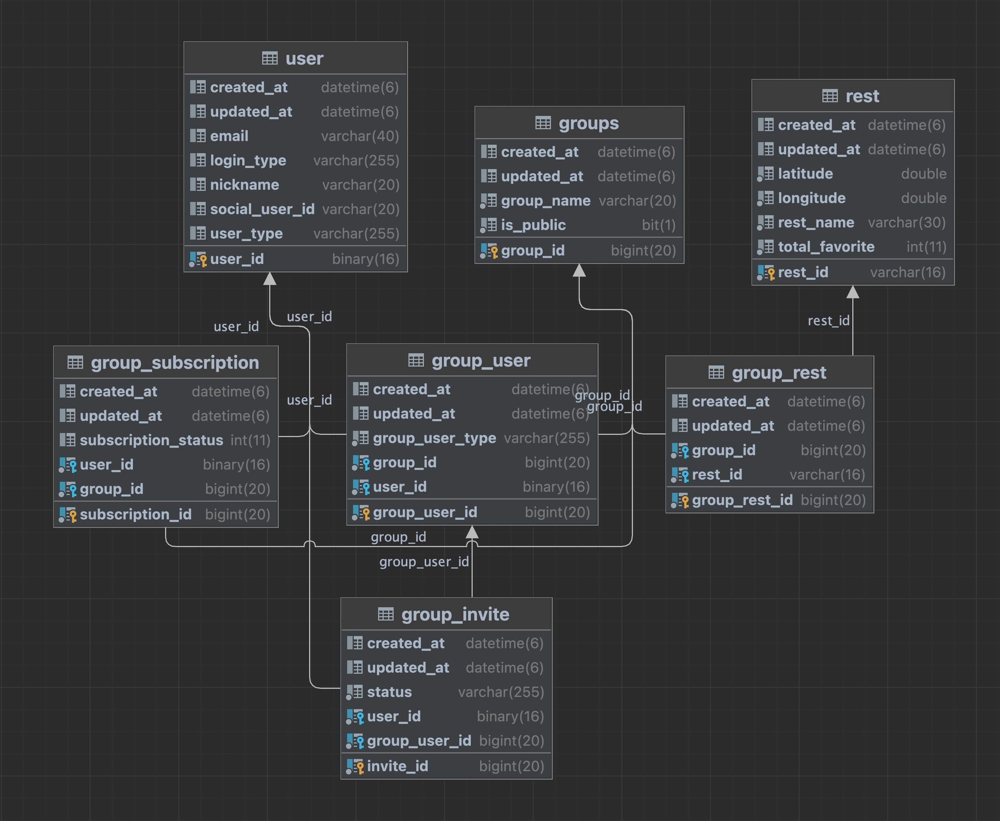
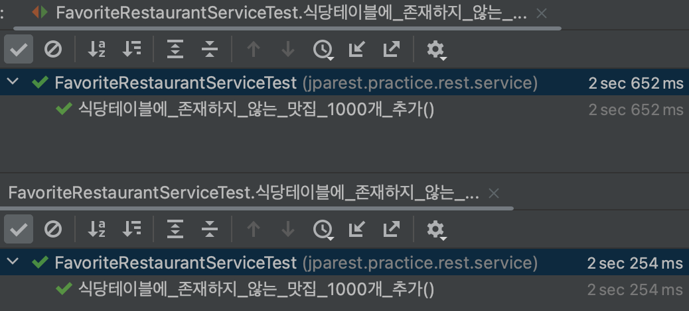

# 스프링 부트로 만드는 맛집 기록 프로젝트

## :clipboard: 사용 기술

### Spring boot
* Spring Data JPA
* Spring Security

### Build tool
* Gradle

### Database
* Mysql
* Redis

### Test
* Junit5

### Docs
* Rest Docs

## :link: Rest API 문서
* [API 문서](https://jpa-rest.vercel.app/)

## :link: 테스트
* [테스트](https://github.com/vvs-kim/jpa_rest/tree/develop/src/test/java/jparest/practice)

## ERD


## 고민한 점
### RESTful API 설계

#### 자원
데이터를 단일 또는 여러개에 대한 행위를 하는 경우에 대해 고민했습니다. 단일 삭제할 때는 단수, 여러개 삭제할 때는 복수 를 사용했으나 자원은 일관성 있게 표시되야 한다고 생각했습니다.
그래서 자원은 모두 복수를 사용하고, 단일 행위의 경우 pathParameter 를 사용하기로 정했습니다.
```shell
GET /api/restaurants          // 리스트 조회
GET /api/restaurants/23523434 // 단일, 상세 조회
```

<br />

#### Delete
Delete 메서드를 사용할 때 보내야 하는 데이터가 하나라면, pathParameter 를 사용하면 간단합니다.
2개 이상일 경우 requestBody 를 이용하고 싶지만 추천하지 않는 방법이라는 글을 봤습니다.

그래서 삭제할 자원의 구체적인 정보에 대해서만 pathParameter 를 사용하고, 그 외의 정보는 queryStringParameter 를 사용했습니다.
보안의 문제가 있는 경우라면, Request header 로 데이터를 전송 받아야겠다고 생각했습니다.
```shell
DELETE /api/restaurants/23523434/favorite?groupId=1
```

<br />

### 반복코드 제거
#### 고아 객체

그룹 -> 그룹맛집(연관관계 주인)<br/>
그룹 -> 그룹유저(연관관계 주인)<br/>
그룹유저 -> 초대(연관관계 주인)

그룹의 마지막 유저가 탙퇴 시, DB 의 4 개의 테이블(그룹, 그룹유저, 초대, 그룹맛집)에서 데이터가 삭제됩니다.
부모 엔티티와 연관관계가 끊어진 자식 엔티티(고아객체)를 자동으로 삭제하도록 설정했습니다.
반복적인 delete 메서드를 줄였습니다.
```java
    @OneToMany(mappedBy = "group", orphanRemoval = true)
    private List<GroupUser> groupUsers = new ArrayList<GroupUser>();
```

<br />

## 기술의 사용 이유

### Spring REST Docs
실무 경험을 하면서 api 문서의 정합성이 중요하다고 생각했습니다.
신규사항 및 변경사항을 옳바르게 전달하려면 문서 툴과 개발 툴의 연관관계가 필요하다고 생각했습니다.

Swagger 의 경우 어노테이션이 컨트롤러 주변에 존재하므로 관심사가 분리되어야 한다고 생각해서 선택하지 않았습니다.
반면, Spring REST Docs 는 테스트 파일에 작성하여 관심사가 분리되고, 테스트 파일 작성이 의무이므로 정합성이 보장아 되는 장점이 있습니다.
이러한 이유로 Spring REST Docs 를 사용했습니다.

### Elastic Beanstalk
간편한 도커 배포와 오토스케일링 서비스를 이용하고자 사용했습니다.
Rolling 배포 옵션을 사용하여 배포 시, 무중단 배포가 가능하여 편리했습니다.

<br />

## 성능 최적화

### 기본 키 직접 할당 전략 시, 새로운 Entity 판별
기본 키 직접 할당 전략을 사용하는 엔티티를 저장할 때 insert 전에 select 쿼리가 호출되는 현상이 있었습니다.
Jpa 는 엔티티를 저장할 때, 새로운 엔티티면 merge, 아니라면 persist 메서드를 호출합니다.
새로운 엔티티를 판별하는 메서드를 오버라이딩 하여 성능을 최적화했습니다.




